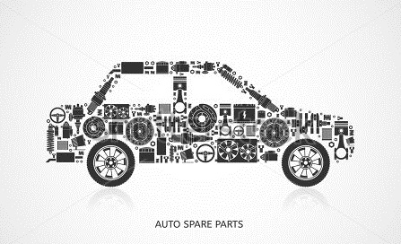

<!-- PROJECT LOGO -->
 

  

  <h3 align="center">Altai Auto</h3>

  

    Online shop for automobile parts
  

# Altai Auto Online Shop

The website made, back in 2016, during the final high school year behalf of the ICT subject as a Final Project. Online shop for my uncle that sells automobile spare parts. First time experiencing Web Development.

## Technology stack
- HTML & CSS + jQuery
- PHP
- XAMPP | phpMyAdmin MySQL database
